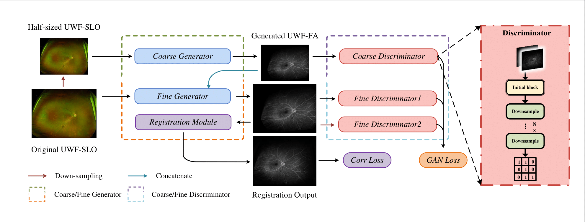
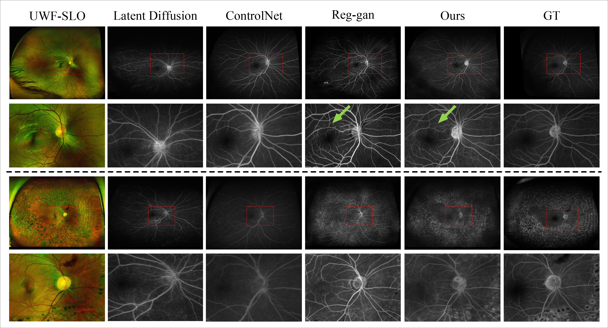

# **UWAFA-GAN**
This code is an enhanced version of the pytorch implementation of the [UWAT-GAN](https://github.com/Tinysqua/UWAT-GAN) and our paper "UWAT-GAN: Ultra-Wide-Angle transformation using Multi-scale Generative Adversarial Nets". It can be used to turning UWF scanning laser ophthalmoscopy(UWF-SLO) to the UWF fluorescein angiography(UWF-FA) and display the tiny vascular lesion areas. It could be trained on a little misalignment paired UWF-SLO and UWF-FA. 

<br><br>

<br><br>

## Generation UWF-FA from UWF-SLO with nice detail 


## Pre-requisties
- Linux
- python>=3.7
- NVIDIA GPU (memory>=10G) + CUDA cuDNN

## How to train
### Preparation of the data
We are diligently navigating through ethical and approval procedures to provide large quantities of trainable data that can enhance the comprehensiveness of our open-source code. However, at present, we are unable to publicly release substantial volumes of data. We appreciate your understanding regarding this matter.
However, if you have your own data, you can still train and generate using our code.
We assume your data, with suffix as ".jpg", are in the path **"dataset/yours"**, firstly we need to random crop them into the training dataset. 
```
python utils/advan_random_crop.py --datadir dataset/yours  --output_dir dataset/data_slo2ffa --suffix .jpg --index_interval 0 --index_interval 100 
```
This will crop the **100** pairs suffix-jpg images from path **"dataset/yours"** and put the result into the path **"dataset/data_slo2ffa"**. Then the training procedure can be exerted. Find the yaml file in the path "config/train_config.yaml", making sure the **data_path** of it is correct. 

Part of train_config.yaml
```
batchsize: 4
epoch: 40
num_D: 2
n_layers: 4

# validation setting
validation_epoch: 41
val_dir: ''

# dataloader
data_path: ["dataset/data_slo2ffa"]
val_length: 900
seed: -1 
img_size: [832, 1088]
```

and run the command:
```
python -u train_changed.py
```

## Get start to the evaluation 
We provide 6 pairs of examples for evaluation in **dataset/example_pairs**, if you have only UWF-SLO and you can try it as well. To evaluate, the first UWF-SLO should be named as 1.jpg, the second as 2.jpg... Just like it in **dataset/example_pairs**
### checkpoint configure
Download the [exp_final](https://drive.google.com/drive/folders/1_Ax2anHkz2CfKJu68UXNNDQ-c7PShIpe?usp=sharing) and make sure the path "./weights/exp_final" correct. Directory "exp_final" should contain three elements:
```
├── exp_final
    ├──discriminator.pt
    ├──generator.pt
    ├──reg.pt
``` 

and run the command:
``` bash
python -u utils/Model_evaluation_without_ffa.py --updir dataset/example_pairs \
    --model_updir weights/exp_final
```

The result will be saved in the path dataset/example_pairs 